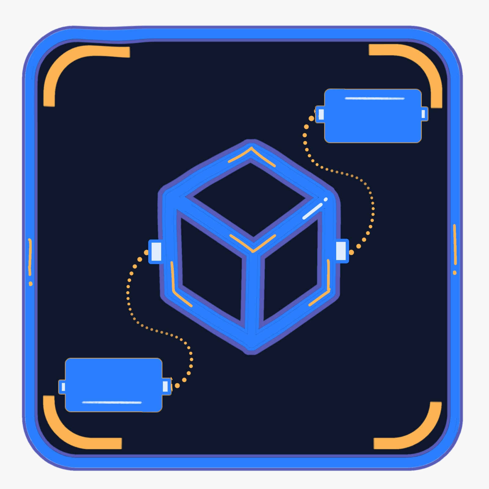
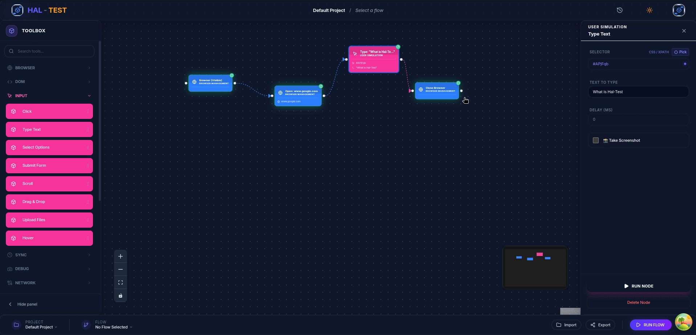

<div align="center">
  

  # HAL-TEST 🤖
  ### The Missing Link in Browser Automation

  [](LICENSE)
  [](https://playwright.dev/)
  [](https://reactflow.dev/)
  [](https://join.slack.com/t/haltest-talk/shared_invite/zt-3tzii9nxh-vgdIcI5A8bg~GCG8QF6MuA)

  **HAL-TEST** is a modern, visual automation framework that bridges the gap between manual QA and technical automation. Built on top of **Playwright**, it provides a high-performance, node-based interface to build, manage, and scale complex browser workflows without writing a single line of boilerplate code.
</div>

---

## 📺 See it in Action

<div align="center">
  
  <p><em>Visual node-based logic with real-time execution feedback.</em></p>
</div>

## 🚀 Why HAL-TEST?

Most automation frameworks suffer from **"Framework Fatigue"**: complex YAMLs, brittle selectors, and high barriers to entry. HAL-TEST changes the game:

* **Low Code, Pro Power**: Use the full strength of Playwright through a visual canvas.
* **Zero Vendor Lock-in**: Export your flows or run them via the **HAL-TEST CLI**.
* **Self-Healing Ready**: Designed to handle dynamic modern web apps with intelligent node logic.
* **Built for Teams**: Allow manual QAs to build tests that Seniors can audit and scale.

## ✨ Key Features

### 🧠 Visual Flow Editor
* **Node-Based Logic**: 50+ specialized nodes for DOM manipulation, network interception, and AI.
* **Smart Connections**: Animated execution feedback—watch your test run in real-time.
* **Category-Specific UI**: Glassmorphic design with 50+ unique icons for instant recognition.
* **[Viewing the App: Visual Documentation](docs/visual-documentation.md)**: Detailed guide for nodes, colors, and real-time feedback.

### 🛠️ Developer-First DX
* **Powerful CLI**: Integrated terminal tool for CI/CD pipelines (GitHub Actions, Jenkins).
* **Network Orchestration**: Mock, intercept, and modify XHR/Fetch requests visually.
* **Session Management**: Persist cookies, local storage, and auth tokens between runs.
* **LLM Integration**: Semantic validation and AI-powered node generation.

---

## 🏗️ Architecture & Tech Stack

- **Frontend**: React 18, React Flow, Motion 12, TanStack Query.
- **Backend**: Node.js, Express, Playwright.
- **Database**: SQLite (local persistence) + IndexedDB (client-side screenshots).
- **Monorepo**: Turbo + pnpm workspaces.

---

## ⚡ Quick Start
The fastest way to get started is using **npx**:
> **Prerequisite:** [Node.js](https://nodejs.org) 20 or newer. That's it — no cloning required.

```bash
npx haltest@latest
```
*This will start the backend server, run pre-requisite checks, and open the HAL-TEST studio in your browser.*

On first run, the launcher verifies that a **Chromium** browser is available for automation (Playwright). If it's missing, you'll be offered an automatic download — no manual steps needed.

---

## 🏗️ Technical Setup (Development)

### Prerequisites
- **Node.js** 20+ and **pnpm**

### 1. Setup
```bash
git clone https://github.com/andresguc1/hal-test.git
cd hal-test
pnpm install
```

### 2. Install Playwright browsers
Browser binaries are **not** downloaded by `pnpm install` automatically. Install all supported engines (Chromium, Firefox, WebKit):

```bash
# Installs the browser binaries + OS system dependencies
pnpm --filter @halt-test/backend exec playwright install --with-deps chromium firefox webkit

# Alternative from the backend directory
cd apps/backend && npx playwright install --with-deps
```

> **ℹ️ OS ↔ Playwright compatibility**: each browser engine maps to a minimum Playwright version by OS.
> For example, **Ubuntu 26.04** (and derivatives) requires **Playwright ≥ 1.61.0** to run Firefox/WebKit;
> older versions fail with `Playwright does not support firefox/webkit on ubuntu26.04-x64`.
> Keep `playwright` and `@playwright/test` aligned in `apps/backend/package.json`.

> **🩺 Compatibility doctor**: on startup the backend runs a cheap check and, if any browser/version is
> missing or incompatible, prints the exact command to fix it. You can also query it anytime:
> `curl http://localhost:2001/api/doctor` (reports OS, Playwright version, installed browsers, and the
> recommended install/update commands).

### 3. Configure Guest Mode
For quick local testing without Supabase:

```bash
# Set in your .env
AUTH_ENABLED=false
VITE_AUTH_ENABLED=false
```

### 4. Run
```bash
pnpm --filter backend db:init
pnpm run dev
```

**App**: [http://localhost:5173/app/](http://localhost:5173/app/)  
**Server**: [http://localhost:2001](http://localhost:2001)

---

## 💻 Terminal CLI
Automate your workflows. You can run the CLI directly via **npx** (recommended) or install it globally.

### Running with NPX
```bash
# Run a flow by ID
npx haltest@latest cli run <flow_id> --headed
```

### Local Installation
If you prefer a local installation:
```bash
cd apps/cli && npm install -g .
```

---

## 🐳 Docker Deployment (Recommended)
To avoid missing system dependencies for Playwright, use Docker:

Bash
docker compose up -d --build
See `DOCKER.md` for detailed production setup.

## ⚡ Developer Workflow

To make contributing easier, we provide unified commands in the root `package.json`:

### Update your Local Repo
Pull the latest changes from GitHub, install all dependencies, and rebuild the frontend monolith in one step:
```bash
pnpm run update:app
```

### Port Management & Cleanup
If you encounter `EADDRINUSE` errors or need to clear the development ports (2001 and 3000), use the unified stop command:
```bash
pnpm run stop
```
The CLI launcher also features **smart port detection**—it will automatically detect if the backend is already running and connect to it instead of failing.

---

## 🤝 Community & Support
Join our Slack: [HAL-TEST Talk](https://join.slack.com/t/haltest-talk/shared_invite/zt-3tzii9nxh-vgdIcI5A8bg~GCG8QF6MuA)

**Star the Repo**: If this project helps you, give us a ⭐!

## 📄 License
Apache License 2.0 - Created by Andresguc1
